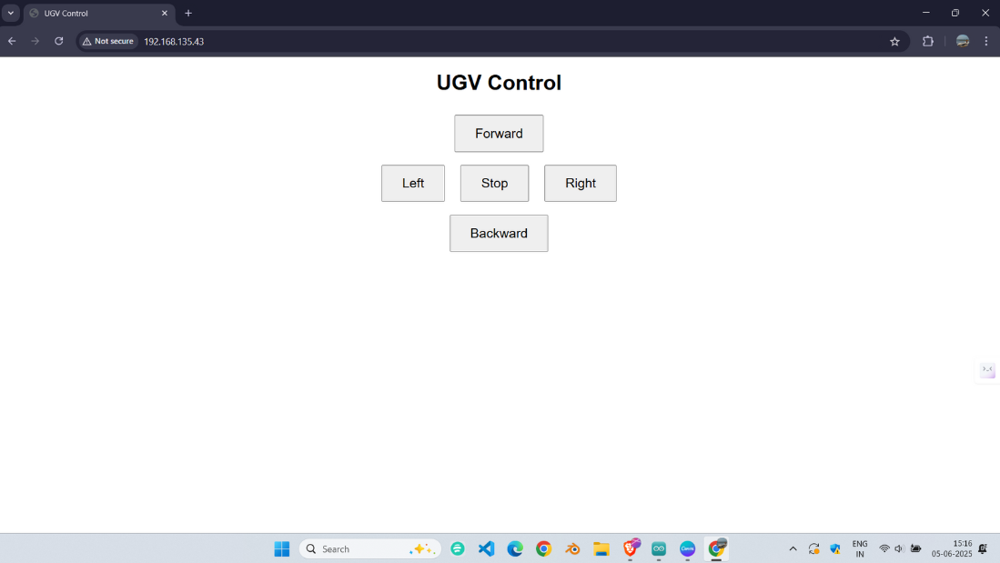

# ESP32 UGV Control System

This project implements a remote control system for an Unmanned Ground Vehicle (UGV) using two ESP32 microcontrollers programmed in the Arduino framework using embedded C. The system leverages **ESP-NOW** for wireless communication and a **web server** for user control. One ESP32 acts as the **master** (hosting a web interface and controlling motors), while the other acts as the **slave** (receiving commands via ESP-NOW to control motors). Both boards interface with an **L293D motor driver** to drive DC motors in a differential drive configuration, enabling movements like forward, backward, left, right, and stop.

## Hardware Requirements

- **2x ESP32 Development Boards** (e.g., ESP32-WROOM-32)
- **L293D Motor Driver** (or equivalent dual H-bridge motor driver)
- **2x DC Motors** (per ESP32, for differential drive UGV)
- **Power Supply**:
  - 3.3V/5V for ESP32 boards (via USB or external power)
  - 5-12V for motors (depending on motor specifications)
- **WiFi Router** (for master ESP32 to host the web server)
- **Jumper Wires** and **Breadboard** or custom PCB
- **Computer** with Arduino IDE installed (or PlatformIO for advanced users)
- **USB Cables** for programming ESP32 boards

## Hardware Connections

### ESP32 to L293D Motor Driver

Both the master and slave ESP32 boards use identical pin configurations to control two DC motors via the L293D motor driver. The L293D acts as a logic circuit to toggle motor directions by controlling GPIO pins.

| ESP32 Pin | L293D Pin | Description |
| --- | --- | --- |
| GPIO 25 | IN1 | Left Motor Forward |
| GPIO 26 | IN2 | Left Motor Backward |
| GPIO 27 | IN3 | Right Motor Forward |
| GPIO 14 | IN4 | Right Motor Backward |
| GND | GND | Common Ground |
| VIN/5V | VCC1 | L293D Logic Power (5V) |
| External | VCC2 | Motor Power (5-12V, per specs) |

- **Enable Pins** (ENA, ENB on L293D): Connect to VCC or set to HIGH for full speed (not controlled in this code).
- **Motors**: Connect to OUT1/OUT2 (left motor) and OUT3/OUT4 (right motor) on the L293D.
- **Power**:
  - ESP32: Power via USB or 5V VIN pin.
  - Motors: Use an external battery (e.g., 7.4V LiPo) connected to L293D VCC2 and GND. Ensure a common ground with the ESP32.
- **Note**: Repeat the same connections for both master and slave ESP32 boards if both are controlling motors.

### Additional Notes

- Ensure the motor power supply matches your DC motors' voltage and current requirements.
- Add decoupling capacitors (e.g., 100µF) across motor power lines to reduce electrical noise.
- Verify all connections before powering on to prevent short circuits or damage to the ESP32 or L293D.

## Software Requirements

- **Arduino IDE** (version 2.x or later recommended, or PlatformIO for advanced embedded development)
- **ESP32 Board Support**: Install via Arduino IDE Boards Manager or PlatformIO.
- **Libraries** (included with ESP32 Arduino core):
  - `WiFi.h` (for WiFi connectivity on the master)
  - `esp_now.h` (for ESP-NOW communication)
  - `WebServer.h` (for hosting the web interface on the master)
- **Source Files**:
  - `slave.ino`: Slave ESP32 code for receiving ESP-NOW commands and controlling motors.
  - `master.ino`: Master ESP32 code for hosting a web server, controlling local motors, and sending ESP-NOW commands to the slave.

## Setup Instructions

1. **Install Arduino IDE or PlatformIO**:

   - Download Arduino IDE from arduino.cc or set up PlatformIO in your preferred IDE.

   - For Arduino IDE, add ESP32 board support:

     ```plaintext
     https://raw.githubusercontent.com/espressif/arduino-esp32/master/package_esp32_index.json
     ```

     - Go to `Tools > Board > Boards Manager`, search for "ESP32", and install the ESP32 package by Espressif Systems.

2. **Configure WiFi Credentials** (Master only):

   - In `master.ino`, update the WiFi credentials to match your router:

     ```cpp
     const char* ssid = "Infinix"; // Replace with your WiFi SSID
     const char* password = "12345678"; // Replace with your WiFi password
     ```

3. **Set Slave MAC Address** (Master only):

   - In `slave.ino`, update the `slaveMacAddress` array with the slave ESP32’s MAC address:

     ```cpp
     uint8_t slaveMacAddress[] = {0xEC, 0x94, 0xCB, 0x52, 0x99, 0x78}; // Replace with slave’s MAC
     ```

   - To obtain the slave’s MAC address:

     - Upload `esp_now_motor_control.ino` to the slave ESP32.
     - Open the Serial Monitor (`Tools > Serial Monitor`, 115200 baud) in Arduino IDE.
     - The slave will print its MAC address (e.g., `Slave ready. MAC Address: XX:XX:XX:XX:XX:XX`).

4. **Upload Code**:

   - Connect each ESP32 to your computer via USB.
   - In Arduino IDE, select `Tools > Board > ESP32 Arduino > ESP32 Dev Module`.
   - Upload `slave.ino` to the slave ESP32.
   - Upload `master.ino` to the master ESP32.
   - For PlatformIO users, create a project, add the source files, and configure `platformio.ini` for ESP32 (e.g., `board = esp32dev`).

5. **Verify Connections**:

   - Ensure both ESP32 boards are powered and connected to the L293D and motors as described.
   - Confirm the master ESP32 is within range of your WiFi router (2.4GHz network required).

## Running the System

1. **Power On**:

   - Power both ESP32 boards via USB or external 5V supply.
   - Connect the motor power supply to the L293D VCC2 and GND.

2. **Slave ESP32**:

   - After uploading `esp_now_motor_control.ino`, open the Serial Monitor (115200 baud) to verify startup.
   - The slave prints its MAC address and waits for ESP-NOW commands to control its motors.

3. **Master ESP32**:

   - After uploading `esp_now_web_control.ino`, open the Serial Monitor (115200 baud).
   - The master connects to the specified WiFi network and prints its IP address (e.g., `192.168.x.x`).
   - If WiFi connection fails after 20 attempts, the master halts (check WiFi credentials in the code).

4. **Access the Web Interface**:

   - On a device (e.g., phone, laptop) connected to the same WiFi network as the master, open a web browser.
   - Enter the master ESP32’s IP address (from Serial Monitor) in the browser (e.g., `http://192.168.x.x`).
   - The web interface displays buttons: **Forward**, **Backward**, **Left**, **Right**, and **Stop**.

5. **Control the UGV**:

   - Click a button on the web interface to send a command (e.g., `FORWARD`).
   - The master ESP32:
     - Controls its own motors using the L293D driver based on the command.
     - Sends the command to the slave ESP32 via ESP-NOW.
   - The slave ESP32 receives the command and controls its motors accordingly.
   - Both UGVs (if both have motors) execute the same movement (Forward, Backward, Left, Right, or Stop).
   - Serial Monitors on both ESP32s display command status and ESP-NOW send/receive logs for debugging.

## How It Works

- **Master ESP32** (`esp_now_web_control.ino`):

  - Hosts a web server on port 80 using `WebServer.h`, serving an HTML page with control buttons.
  - Handles GET requests at `/command?dir=<command>` to process user inputs.
  - Controls local motors via GPIO pin toggling through the L293D driver.
  - Sends commands to the slave via ESP-NOW using `esp_now_send`.
  - Logs ESP-NOW transmission status (success/fail) using the `onDataSent` callback.

- **Slave ESP32** (`esp_now_motor_control.ino`):

  - Listens for ESP-NOW packets using the `onDataRecv` callback.
  - Parses received commands and toggles GPIO pins to control motors via the L293D driver.
  - Logs received commands to the Serial Monitor for debugging.

- **Motor Control** (Both ESP32s):

  - The L293D acts as a logic circuit, decoding GPIO signals to control motor direction:
    - **Forward**: Left motor forward (IN1 HIGH, IN2 LOW), right motor forward (IN3 HIGH, IN4 LOW).
    - **Backward**: Left motor backward (IN1 LOW, IN2 HIGH), right motor backward (IN3 LOW, IN4 HIGH).
    - **Left**: Left motor backward, right motor forward.
    - **Right**: Left motor forward, right motor backward.
    - **Stop**: All inputs LOW.
  - The system uses binary logic to drive the motors, similar to flip-flops or binary counters in digital circuits.

- **Web Interface**:
  - 

  - The HTML page uses JavaScript (`fetch` API) to send commands to the master ESP32.
