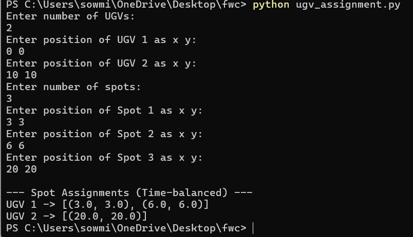

# UGV Spot Allocation Explanation

## Overview
This project implements a spot allocation system for multiple Unmanned Ground Vehicles (UGVs) to minimize the maximum travel distance for any single UGV. It uses a brute-force approach to evaluate all possible spot assignments and select the optimal one. The system is implemented in both Python and Arduino (C++) versions, with a web interface for the Arduino version.

## Allocation Process
The allocation assigns a set of spots (2D coordinates) to multiple UGVs, starting from their initial positions, to balance the workload by minimizing the maximum total distance traveled by any UGV. Below is how the allocation is performed:

### 1. Distance Calculation
- **Function**: Computes the Euclidean distance between two points (e.g., UGV to spot or spot to spot).
- **Python**: Uses `math.hypot(p1[0]-p2[0], p1[1]-p2[1])`.
- **Arduino**: Uses `sqrt(pow(a.x - b.x, 2) + pow(a.y - b.y, 2))`.
- This calculates the straight-line distance between coordinates `(x1, y1)` and `(x2, y2)`.

### 2. Total Distance for a UGV
- **Function**: `total_time` (Python) or `totalDistance` (Arduino).
- Calculates the total distance for a UGV’s route:
  - From its starting position to the first assigned spot.
  - Between consecutive spots in the assigned order.
- Returns 0 if no spots are assigned.
- **Python**: Iterates over the list of spots for a UGV.
- **Arduino**: Similar logic but uses arrays and a count of assigned spots.

### 3. Generating All Possible Assignments
- **Function**: `generate_assignments` (Python) or part of `allocateUGVs` (Arduino).
- Generates all possible ways to assign spots to UGVs:
  - Each spot is assigned to one of the UGVs.
  - **Python**: Uses `itertools.product` to create all combinations of UGV IDs for the number of spots, stored in a `defaultdict` for each UGV’s assigned spots.
  - **Arduino**: Uses a base-n (n = number of UGVs) counting approach to generate assignments. Each spot is assigned a UGV ID (0 to ugv_count-1) via modulo operations on a counter (`mask`).
- Example: For 2 UGVs and 3 spots, possible assignments include (0,0,0), (0,0,1), (0,1,0), etc., where each number is the UGV ID for a spot.

### 4. Evaluating Assignments
- **Function**: `assign_spots_optimally` (Python) or `allocateUGVs` (Arduino).
- Iterates through all possible assignments:
  - For each assignment, compute the total distance for each UGV’s assigned spots.
  - Find the maximum distance among all UGVs for that assignment.
  - Track the assignment with the smallest maximum distance (`best_max_time` in Python, `bestMaxTime` in Arduino).
- The optimal assignment minimizes the maximum distance any single UGV travels, balancing the workload.

### 5. Input and Output
- **Python**:
  - Takes user input via console for the number of UGVs, their positions (x, y), and spot coordinates.
  - Outputs the optimal assignment for each UGV as a list of spots.
- **Arduino**:
  - Uses a web interface to input UGV and spot coordinates (comma-separated x y pairs).
  - Processes inputs by parsing strings into `Point` structures.
  - Displays the optimal assignment on the webpage, showing which spots are assigned to each UGV.
  - Communicates via Wi-Fi, with the ESP32 hosting a server at its IP address.

### 6. Implementation Details
- **Python**: Uses `collections.defaultdict` for flexible assignment storage and `itertools.product` for efficient combination generation.
- **Arduino**: Uses fixed-size arrays and manual iteration due to memory constraints. Stores results in a global `assignmentResult` string for web display.
- Both assume spots are visited in the order provided, without optimizing the sequence within a UGV’s route (not a full Traveling Salesman Problem solution).

## Usage
- **Python**: Run the script, enter the number of UGVs and spots, and input their coordinates. The program outputs the optimal spot assignments.
- **Arduino**: Upload the code to an ESP32, connect to Wi-Fi, access the web interface via the ESP32’s IP, input coordinates, and view assignments.

## Notes
- The brute-force approach is computationally intensive for large numbers of spots (O(n^k) where n = UGVs, k = spots).
- Assumes straight-line travel and no obstacles.
- Arduino version requires a stable Wi-Fi connection and sufficient memory for the input sizes.
