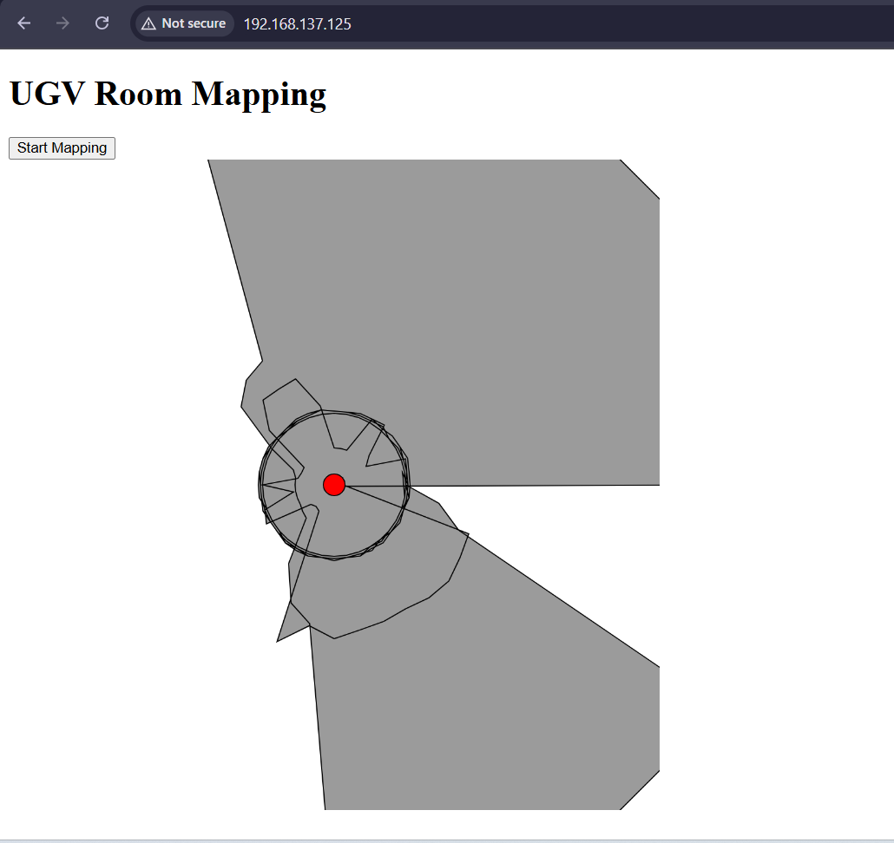
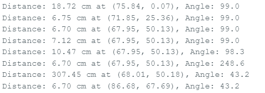

# UGV Room Mapping Project

## Overview
This project implements a room mapping system using an ESP32-based Unmanned Ground Vehicle (UGV). The UGV uses an ultrasonic sensor to measure distances while rotating and moving forward, creating a 2D map of its surroundings. The map is visualized in real-time on a web interface using p5.js.

## Features
- Connects to Wi-Fi for remote access
- Web server for user interface
- WebSocket for real-time data transmission
- Ultrasonic sensor for distance measurement
- Motor control for movement and rotation
- Real-time 2D mapping visualization

## Hardware Requirements
- ESP32 microcontroller
- HC-SR04 ultrasonic sensor
- L298N motor driver
- DC motors with wheels
- Wi-Fi network

## Pin Configuration
- Ultrasonic Sensor:
  - Trigger: GPIO 5
  - Echo: GPIO 18
- Motor Driver:
  - IN1: GPIO 14
  - IN2: GPIO 27
  - IN3: GPIO 26
  - IN4: GPIO 25
  - ENA: GPIO 33
  - ENB: GPIO 32

## Software Dependencies
- Arduino IDE
- ESP32 board support
- Libraries:
  - WiFi.h
  - WebServer.h
  - WebSocketsServer.h
  - NewPing.h

## Setup Instructions
1. Install required libraries in Arduino IDE
2. Update Wi-Fi credentials (SSID and password) in the code
3. Connect hardware according to pin configuration
4. Upload code to ESP32
5. Access the web interface using the IP address printed to Serial Monitor
6. Click "Start Mapping" to begin the mapping process

## Usage
- Open the web interface in a browser
- Press the "Start Mapping" button to initiate mapping
- The UGV will rotate, measure distances, and move forward
- The web interface displays a real-time 2D map of the scanned area

## Notes
- Ensure stable Wi-Fi connection
- Maximum detection distance is set to 200cm
- Motor speed and timing parameters can be adjusted via constants
- The map is visualized using p5.js, showing a red dot for the UGV's position
