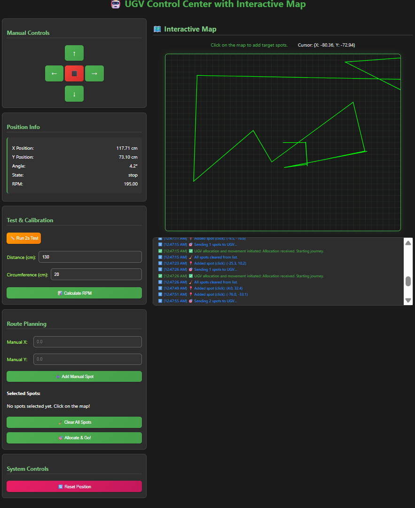

# ESP32 UGV Control and Autonomous Navigation

## Overview
This project implements a control system for an ESP32-based Unmanned Ground Vehicle (UGV) with a web-based interface. It allows users to:
- Manually control the UGV’s movements (forward, backward, left, right, stop).
- Calibrate motor RPM based on wheel parameters.
- Track the UGV’s position and orientation in real-time using a basic odometry model.
- Select multiple target spots on an interactive map or via manual input and command the UGV to visit them autonomously in an optimized order using the Nearest Neighbor algorithm.

The system is designed for a differential-drive UGV with two DC motors controlled by an L293D motor driver, connected to a Wi-Fi network for remote operation.

## Hardware Requirements
- **ESP32 Microcontroller**: Any ESP32 development board (e.g., ESP32-WROOM-32).
- **L293D Motor Driver**: Controls two DC motors.
- **DC Motors with Wheels**: For differential drive (left and right wheels).
- **Wi-Fi Network**: For communication with the web interface.
- **Power Supply**: Suitable for the ESP32 and motors (e.g., battery pack).

### Pinout
- **Motor A (Left)**: IN1 (GPIO 14), IN2 (GPIO 27), ENA (GPIO 33, PWM)
- **Motor B (Right)**: IN1 (GPIO 26), IN2 (GPIO 25), ENB (GPIO 32, PWM)

## Software Dependencies
- **Arduino IDE**: For compiling and uploading the code.
- **Libraries**:
  - `WiFi.h`: For ESP32 Wi-Fi connectivity.
  - `WebServer.h`: For hosting the web interface.
  - `vector`: For managing spot coordinates.
  - `cmath`: For mathematical calculations (e.g., distance, angles).

## Setup Instructions
1. **Install Arduino IDE**: Download and install the latest version from [arduino.cc](https://www.arduino.cc/en/software).
2. **Add ESP32 Board Support**:
   - In Arduino IDE, go to `File > Preferences`, add the ESP32 board URL: `https://dl.espressif.com/dl/package_esp32_index.json`.
   - Install the ESP32 board package via `Tools > Board > Boards Manager`.
3. **Install Libraries**: Ensure `WiFi.h` and `WebServer.h` are available (included with the ESP32 core).
4. **Connect Hardware**:
   - Wire the L293D motor driver to the ESP32 as per the pinout.
   - Connect motors to the L293D outputs.
   - Power the ESP32 and motors appropriately.
5. **Update Wi-Fi Credentials**:
   - In `UGVControl.ino`, modify `ssid` and `password` to match your Wi-Fi network.
6. **Upload Code**:
   - Open `UGVControl.ino` in Arduino IDE.
   - Select your ESP32 board and port under `Tools`.
   - Upload the code.
7. **Access the Web Interface**:
   - Open the Serial Monitor (115200 baud) to view the ESP32’s IP address after Wi-Fi connection.
   - Enter the IP address in a web browser to access the control interface.

## Usage
The web interface provides a user-friendly way to interact with the UGV:

### Manual Controls
- **Directional Buttons**: Click or hold buttons (↑, ←, ⬛, →, ↓) to move forward, turn left, stop, turn right, or move backward.
- **Touch Support**: Buttons support touch events for mobile devices.
- **Test Run**: Click “Run 2s Test” to move forward for 2 seconds (useful for calibration).

### Calibration
- **Calculate RPM**:
  - Run the 2-second test and measure the distance traveled (in cm).
  - Measure the wheel circumference (in cm).
  - Enter both values in the “Test & Calibration” section and click “Calculate RPM”.
  - The system computes RPM using `RPM = (distance / circumference) * (60 / 2)` and stores it for movement calculations.

### Position Tracking
- **Real-Time Display**: The “Position Info” section shows the UGV’s current (x, y) coordinates (in cm), angle (in degrees, 0 = +X, counter-clockwise), motor state, and RPM.
- **Interactive Map**: A grid displays the UGV’s position as a red dot, updating every 100ms. A green polyline traces the UGV’s path.
- **Reset Position**: Click “Reset Position” to set the UGV’s coordinates and angle to (0, 0, 0°).

### Route Planning
- **Add Spots**:
  - **Map Clicks**: Click on the interactive map to add target spots (blue dots). Cursor coordinates are shown in real-time.
  - **Manual Input**: Enter x, y coordinates in the “Route Planning” section and click “Add Manual Spot”.
- **Spot List**: Displays all selected spots with coordinates.
- **Clear Spots**: Click “Clear All Spots” to remove all targets from the list and map.
- **Allocate & Go**: Click “Allocate & Go!” to send spots to the UGV, which sorts them using the Nearest Neighbor algorithm and visits each in sequence.

### System Status
- A log in the “System Status” section shows timestamped messages (e.g., commands, errors, navigation updates) with icons (✅ success, ❌ error, ℹ️ info, ⚠️ warning).

## How It Works
The code integrates several components to control the UGV and provide a seamless user experience. Below is an explanation of its key functionalities:

### 1. Core Setup and Loop
- **File**: `interface.ino`
- **Purpose**: Initializes the ESP32, sets up motor pins, connects to Wi-Fi, and starts the web server.
- **Key Functions**:
  - `setup()`: Configures serial communication, motor pins, Wi-Fi, and web server routes. Attempts Wi-Fi connection for up to 10 seconds, with a fallback to soft AP mode (commented out).
  - `loop()`: Handles incoming web client requests via `server.handleClient()`. Position updates are triggered by client requests or motor commands to optimize performance.

### 2. Motor Control
- **Functions**: `moveForward`, `moveBackward`, `turnLeft`, `turnRight`, `stopMotors`
- **Purpose**: Controls the DC motors via the L293D driver using PWM signals for speed and direction.
- **Details**:
  - Each function sets appropriate pin states (HIGH/LOW for direction, PWM for speed).
  - Forward/backward uses full speed (PWM 255); turns use reduced speed (PWM 200) for stability.
  - Updates motor state (`current_motor_state`) and movement flag (`is_moving`) for tracking.
  - Calls `updatePosition()` before changing state to capture the latest position.

### 3. Position Tracking
- **Function**: `updatePosition`
- **Purpose**: Estimates the UGV’s position (x, y) and orientation (angle) using odometry based on motor state, RPM, and wheel circumference.
- **Details**:
  - Calculates distance moved since the last update using `distance = (rpm * wheel_circumference) / 60 * elapsed_time`.
  - For forward/backward, updates (x, y) using trigonometry: `x += distance * cos(angle)`, `y += distance * sin(angle)`.
  - For turns, updates the angle based on the wheelbase: `angle_change = distance / (wheel_base_cm / 2)`.
  - Maintains angles between 0–360° and updates `motor_start_time` for continuous tracking.
  - Triggered before motor commands and by `/position` requests from the web client.

### 4. Navigation to a Single Point
- **Function**: `gotoPosition(float target_x, float target_y)`
- **Purpose**: Moves the UGV to a specified (x, y) coordinate by turning to face the target and moving forward.
- **Details**:
  - Calculates the distance (`dx`, `dy`) and angle to the target using `atan2(dy, dx)`.
  - If the distance is < 2 cm, skips movement to avoid jitter.
  - Computes the required turn angle (normalized to -180° to 180°).
  - If the turn angle is > 5°, performs a left (CCW) or right (CW) turn for the estimated duration, calculated as `duration = (angle / 360) * (PI * wheel_base_cm / turn_speed)`.
  - Moves forward the target distance, calculated as `duration = distance / (rpm * wheel_circumference / 60)`.
  - Uses blocking `delay` calls for simplicity, with pauses (200ms) between movements.
  - Updates position to the target coordinates post-movement for UI consistency.

### 5. Route Planning with Nearest Neighbor
- **Function**: `sortSpotsByNearestNeighbor(Point start, std::vector<Point>& spots)`
- **Purpose**: Sorts a list of target spots to minimize travel distance using the Nearest Neighbor algorithm.
- **Details**:
  - Starts from the UGV’s current position (`start`).
  - Iteratively selects the closest unvisited spot, adds it to a sorted list, and removes it from the input list.
  - Uses `distance(Point a, Point b)` to compute Euclidean distances.
  - Modifies the input `spots` vector in-place to contain the sorted order.
  - Handles empty spot lists and includes error logging for robustness.

### 6. Web Server and Interface
- **Functions**: `handleRoot`, `handleControl`, `handlePosition`, `handleResetPosition`, `handleAllocateAndGo`, and inline `/test` and `/calculate` handlers
- **Purpose**: Serves a web interface and processes client requests for control, calibration, and navigation.
- **Details**:
  - **`/root`**: Serves an HTML page with:
    - **Controls**: Directional buttons, test run, RPM calibration, manual spot input, and spot allocation.
    - **Map**: An 800x600px grid where users can click to add spots (1 cm = 4 pixels). Displays the UGV (red dot), path (green line), and spots (blue dots).
    - **Position Info**: Shows real-time (x, y, angle, state, RPM).
    - **Status Log**: Displays timestamped messages with icons.
  - **`/control`**: Processes movement commands (e.g., `cmd=forward`) and returns JSON status.
  - **`/position`**: Returns current position and state as JSON, updated every 100ms by the client.
  - **`/reset_position`**: Resets position to (0, 0, 0°) and stops motors.
  - **`/test`**: Runs a 2-second forward movement for calibration.
  - **`/calculate`**: Computes RPM from distance and wheel circumference.
  - **`/allocate_and_go`**: Parses a comma-separated string of spot coordinates, sorts them using `sortSpotsByNearestNeighbor`, and sequentially calls `gotoPosition` for each spot.

### 7. Client-Side JavaScript
- **Location**: Embedded in `handleRoot`’s HTML
- **Purpose**: Manages the web interface’s interactivity and communication with the ESP32.
- **Details**:
  - **Position Updates**: Polls `/position` every 100ms to update the UGV’s position on the map and info display.
  - **Path Drawing**: Maintains a `pathPoints` array to draw a green polyline, adding points when the UGV moves > 0.5 cm.
  - **Spot Management**: Handles map clicks and manual inputs to add spots to `ugvSpots`, displays them as blue dots, and lists them in the UI.
  - **Commands**: Sends movement commands, calibration data, and spot lists to the ESP32 via Fetch API.
  - **Status Log**: Adds timestamped messages with color-coded icons for user feedback.
  - **Coordinate Conversion**: Maps world coordinates (cm) to screen pixels (1 cm = 4 px) with the map’s center as (0, 0).

## File Structure
The project is contained in a single file for simplicity but is logically modular:
- **File**: `interface.ino` 
  - **Structure**:
    - **Includes and Globals**: Wi-Fi, motor pins, and global variables (e.g., `current_x`, `ugv_spots_to_visit`).
    - **Motor Control**: Functions to drive motors (`moveForward`, etc.).
    - **Navigation**: Position tracking and single-point navigation (`updatePosition`, `gotoPosition`).
    - **Route Planning**: Nearest Neighbor sorting (`sortSpotsByNearestNeighbor`).
    - **Web Server**: HTTP routes and HTML interface (`handleRoot`, etc.).
    - **Setup and Loop**: Initializes hardware and runs the server.

For larger projects, consider splitting into separate `.h` files (e.g., `UGVNavigation.h`, `WebServerLogic.h`) to improve maintainability.

## Notes
- **Calibration**: Accurate RPM and wheel circumference are critical for precise movement and position tracking.
- **Odometry Limitations**: The system uses open-loop odometry, which may drift over time due to wheel slip or uneven surfaces. Consider adding encoders for improved accuracy.
- **Blocking Delays**: `gotoPosition` uses `delay` for simplicity, which may block other operations. For real-time applications, consider non-blocking approaches.
- **Wi-Fi Stability**: Ensure a strong Wi-Fi signal to avoid connection issues. The code includes a fallback AP mode (commented out).
- **Scalability**: The Nearest Neighbor algorithm is simple but suboptimal for many points. For advanced applications, implement a Traveling Salesman Problem solver.
- **Safety**: Test in a controlled environment to avoid collisions or motor damage.

## Example Workflow
1. Connect the ESP32 to Wi-Fi and access the IP in a browser.
2. Run a 2-second test, measure distance (e.g., 20 cm), and input wheel circumference (e.g., 18.85 cm) to calculate RPM.
3. Click on the map or enter coordinates to add target spots (e.g., (10, 10), (20, 0)).
4. Click “Allocate & Go!” to send spots to the UGV, which sorts them and navigates sequentially.
5. Monitor the UGV’s path and position on the map, with status updates in the log.
