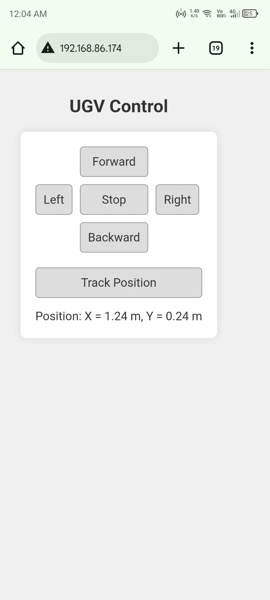

# UGV Control Project

## Overview
ESP32-based UGV control system with MPU6050 for position tracking and web interface for remote control.

## Hardware
- ESP32
- L293D motor driver
- MPU6050 sensor
- DC motors

## Pinout
- Motors: IN1(14), IN2(27), ENA(33), IN3(26), IN4(25), ENB(32)
- MPU6050: SDA(21), SCL(22)

## Usage
- Use web buttons or keys (WASD, arrows, space, T) to control UGV
- Track position with "Track Position" button
- 
