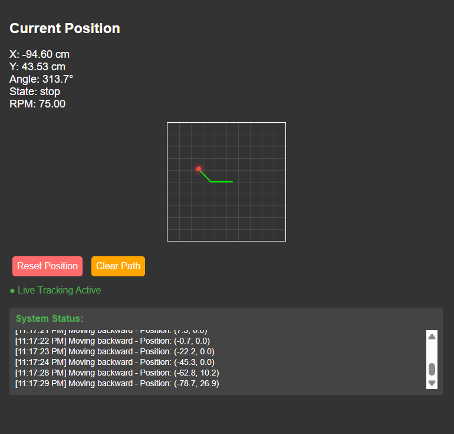

# UGV Control and Position Tracking

## Overview
This project implements a control and position tracking system for an ESP32-based Unmanned Ground Vehicle (UGV) using a web interface. The system allows manual control of the UGV, calculates motor RPM based on wheel parameters, and tracks the UGV's position in real-time, displaying it visually on a web-based grid.

## Hardware
- ESP32 microcontroller
- L293D motor driver
- DC motors with wheels
- Wi-Fi network

## Pinout
- Motor A (Left): IN1 (GPIO 14), IN2 (GPIO 27), ENA (GPIO 33)
- Motor B (Right): IN1 (GPIO 26), IN2 (GPIO 25), ENB (GPIO 32)

## Software Dependencies
- Arduino IDE
- Libraries: WiFi.h, WebServer.h

## Setup
1. Install Arduino IDE and required libraries.
2. Update Wi-Fi credentials (`ssid`, `password`) in the code.
3. Connect the motor driver and motors to the ESP32 as per the pinout.
4. Upload the code to the ESP32.
5. Access the web interface using the ESP32's IP address (printed to Serial Monitor).

## Usage
- **Manual Control**: Use web buttons (Forward, Backward, Left, Right, Stop) or run a 2-second forward test.
- **RPM Calculation**: Enter the distance traveled in 2 seconds and wheel circumference to calculate RPM.
- **Go to Position**: Input target (x, y) coordinates to move the UGV (requires RPM calculation).
- **Position Tracking**: View real-time position (x, y, angle) and motor state on the web interface, with a visual grid showing the UGV's path.
- **Reset/Clear**: Reset position to (0,0) or clear the path display.
- 

## Features
- Wi-Fi-based web interface for control and monitoring.
- Real-time position tracking using motor RPM and wheel parameters.
- Visual grid with a moving dot and path line to show UGV movement.
- Status log for system events (commands, errors, etc.).
- Supports precise movement to specified coordinates via sequential X and Y movements.

## Notes
- Requires accurate wheel circumference and distance measurements for RPM calculation.
- Position tracking assumes straight-line movement and a fixed wheelbase (14 cm).
- The `/goto` endpoint moves the UGV in a two-step process: X direction, then a 90-degree turn, followed by Y direction.
- Ensure a stable Wi-Fi connection for reliable operation.
